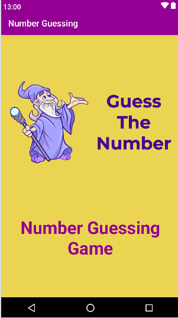

# Number Guessing Game
Enjoy a fun number guessing game on your Android device! Guess the hidden number within a range and challenge yourself with each attempt. Perfect for sharpening your guessing skills and enjoying moments of playful challenge. 
## Features : 
- Random Number Generation: Generates a random number within a specified range.
- User Input: Allows users to guess the number through a simple input interface.
- Feedback System: Provides feedback on whether the guessed number is too high, too low, or correct.
- Attempts Tracking: Keeps track of the number of attempts made by the user.
- Reset Option: Option to reset the game and start over.
## Tools Used :
- Languages: Java
- Frameworks: Android SDK
- IDE: Android Studio
- Version Control: Git
## Screenshots :

  

## Installation :
1. Clone the repository :
~~~
  git clone https://github.com/HACHEM98/NumberGuessingGame.git
~~~~
4. Open the project in Android Studio .
5. Build the project and run it on an emulator or a physical device.  
## How to Play :
1. Open the app.
2. Enter your guess in the input field.
3. Click the "Guess" button.
4. The app will tell you if your guess is too high, too low, or correct.
5. Keep guessing until you find the correct number.
6. Use the "Reset" button to start a new game.
## Technical Details :
- Min SDK Version: 21 (Lollipop)
- Target SDK Version: 30 (Android 11)
- Gradle: Used for build automation
- UI Components: EditText, Button, TextView for user interaction and feedback
## Contributing :
1. Fork the repository.
   
2. Create your feature branch:
   ~~~
   git checkout -b feature/YourFeature
   ~~~~
3. Commit your changes:
~~~
    git commit -m 'Add some feature'
~~~~
4. Push to the branch:
~~~~
   git push origin feature/YourFeature
~~~~
5. Open a pull request.
## License :
This project is licensed under the MIT License. See the LICENSE file for more details.
## Contact :
Hachem - hachemslimene31@gmail.com   
       
